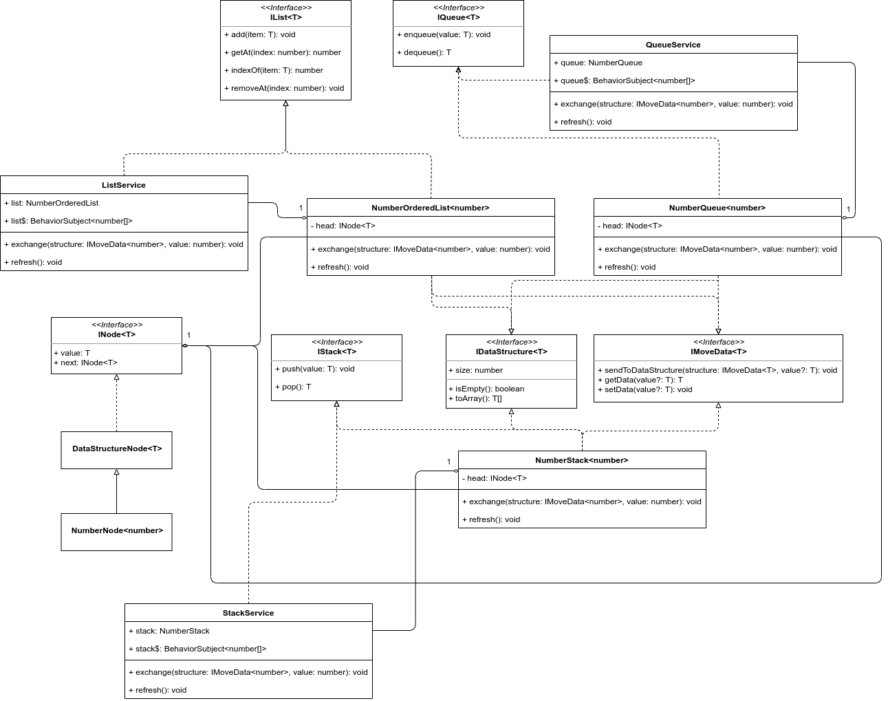

# DataStructures

## Important

Data Structures used:

1. Ordered List
2. Queue
3. Stack

Models are found in **src/app/shared/models**

### Class Diagram

## Setup Guide

This project was generated with [Angular CLI](https://github.com/angular/angular-cli) version 11.0.5.

You must have node installed, run `npm install` and then `npm start`

### Further help

To get more help on the Angular CLI use `ng help` or go check out the [Angular CLI Overview and Command Reference](https://angular.io/cli) page.
